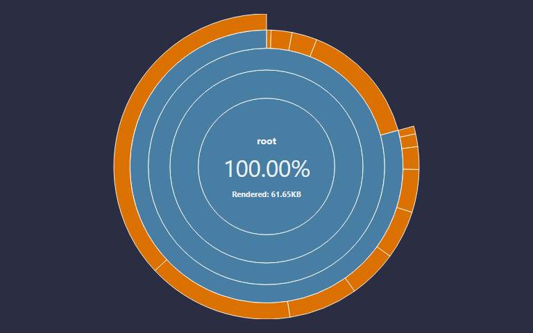
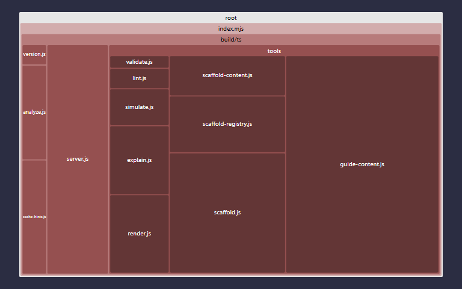
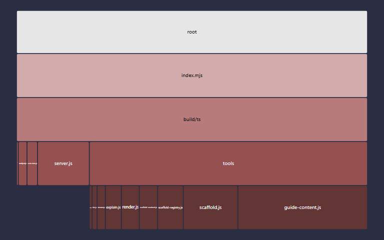

# fsl-mcp v0.6.0

> Version 0.6.0 was built on Thursday, July 30, 2026 at GMT-07:00 `1785462804696` from hash `0b1c584`.

**fsl-mcp** is an MCP (Model Context Protocol) stdio server that lets an AI agent *author* [FSL](https://github.com/StoneCypher/jssm) finite-state machines — giving the model the same structured feedback the FSL editor gives a human (parse diagnostics, a rendered diagram, a plain-English explanation, a step-by-step simulation, and style lint notes) instead of leaving it to guess whether the FSL it just wrote is even valid. It wraps [`jssm`](https://github.com/StoneCypher/jssm), the reference FSL implementation, and exposes seven tools over stdio (five authoring tools, plus `fsl_guide` guidance and `fsl_scaffold` preset generation) via the official [`@modelcontextprotocol/server`](https://github.com/modelcontextprotocol/typescript-sdk) package.

<!-- Supported embeds: 1785462804696 Thursday, July 30, 2026 at GMT-07:00 100 86 37 0b1c584 27.54 21.19 18.07 22.82 6 195 100 100 100 189 0.6.0 -->

&nbsp;

## Install / run

fsl-mcp ships as a standalone package and runs with no local install:

```sh
npx fsl-mcp
```

Point any MCP-speaking client at it with a stdio server entry:

```json
{
  "mcpServers": {
    "fsl": { "command": "npx", "args": ["fsl-mcp"] }
  }
}
```

&nbsp;

## The seven tools

Every tool takes FSL `source` (a string) and returns structured JSON — never a thrown error for bad FSL, always diagnostics. The exceptions are `fsl_guide`, which takes no source, and `fsl_scaffold`, which takes no source but generates one.

| Tool | Input | Returns |
|---|---|---|
| `fsl_validate` | `source` | `{ valid, diagnostics: [{severity, message, line, col}] }` |
| `fsl_explain` | `source` | `{ states, transitions, start, terminals, summary }`, or diagnostics if invalid |
| `fsl_simulate` | `source`, `actions: string[]` | `{ endState, path, legalNext, rejected? }`, or diagnostics if invalid |
| `fsl_lint` | `source` | `{ notes: [{rule, message, line}] }` |
| `fsl_guide` | `topic: "language" \| "flowcharts"` | FSL authoring guidance as markdown - topics: language, flowcharts |
| `fsl_scaffold` | `preset`, `machine_name?`, `roles?` | complete compiling starter FSL from presets (8 presets, 5 families) with your names substituted |

Under the hood, every source-taking tool runs the same non-throwing `analyze()` pass first and short-circuits to diagnostics on a compile error, so a model can always find out *why* its FSL didn't work instead of getting an exception. `fsl_scaffold` runs the same `analyze()` pass on its *generated* source before returning it, so its output carries the same guarantee.

### Protocol revisions

fsl-mcp speaks MCP revision `2026-07-28` and the legacy `2025-11-25` family
from the same stdio process, so it works with both current and older clients
without configuration.

The `tools/list` response carries a one-hour cache hint (`cacheScope:
"public"`), since the tool set is compiled in and cannot change while the
server runs. Set `FSL_MCP_TOOLS_TTL_MS` to another whole number of
milliseconds to shorten or lengthen that window; `0` marks every response
immediately stale, which is what you want while developing against a local
build. The hint fields are still present at `0` - it is a zero-length
freshness window, not an absent hint. An invalid value is ignored with a
warning on stderr. Cache hints appear on modern responses only - legacy
responses are unaffected.

### fsl_render

Render FSL to a diagram.

| format | returns |
|--------|---------|
| `svg` (default) | SVG text |
| `dot` | Graphviz DOT text |
| `png` / `jpeg` | an MCP image content block (the model can see it) |
| `gif` | an animated random walk as an image content block |

Raster options: `width`, `height`, `scale` (zoom %, 100 = 3x natural), `quality`
(jpeg 1-100), `delay` (gif centiseconds/frame), `maxFrames` (gif frame ceiling -
keep it at or under 20 in chat contexts). PNG and GIF work in plain Node (via
jssm's bundled resvg-wasm); JPEG needs a Canvas-capable runtime and otherwise
degrades to SVG plus a note, as does any raster format when no backend is
available. Invalid source returns diagnostics, as everywhere else.

### fsl_guide

Returns authoring guidance as markdown, straight from the server - no
out-of-band primer pasting needed.

- `topic: "language"` - the full FSL primer. In our evals, putting this
  primer in-band lifted a weak model from 55% to 95% correctness - but
  models don't call it unprompted, so instruct your agent to call it before
  its first FSL.
- `topic: "flowcharts"` - the flowchart idiom: decision diamonds with labeled
  branches, terminals, failure paths on `~>`, layout, and a worked example.

This is one of two tools that take no FSL source; it cannot fail and does not
touch the parser.

### fsl_scaffold

Returns a complete, compiling FSL starting document - pick a preset, pass
your names, get source ready for fsl_validate / fsl_render.

- Eight presets across five families: flowchart, pipeline, decision,
  review-loop (flowchart); handshake (protocol); job-lifecycle (process);
  org-chart (orgchart); network-topology (network).
- Role slots rename states and action labels; multi-word names are quoted
  automatically. List slots are fixed-arity - a scaffold is a starting
  point, and adding a stage is a one-line edit.
- Every result is analyze-verified before it is returned; diagram-family
  presets (org-chart, network-topology) say so when simulation is
  meaningless.

&nbsp;

## Ceilings (v1)

- Raster ceilings: PNG and GIF rasterize in plain Node (via jssm's bundled resvg-wasm); JPEG needs a Canvas-capable runtime and otherwise degrades to SVG plus a `note`. Any raster format degrades the same way when no backend is available.
- **Simulation** matches `fsl_simulate`'s `actions` against edge *action labels* first, then falls back to target-state names. Machines whose edges carry no action labels will report an empty `legalNext` even where target-state transitions are legal — this is a labeling ceiling, not a bug in the walk itself.

&nbsp;

## Test status

<table>
  <tr>
    <th></th>
    <th>Count</th>
    <th>Statement</th>
    <th>Branch</th>
    <th>Func</th>
    <th>Line</th>
  </tr>
  <tr>
    <th>Unit</th>
    <td>189</td>
    <td>100<small>%</small></td>
    <td>100<small>%</small></td>
    <td>100<small>%</small></td>
    <td>100<small>%</small></td>
  </tr>
  <tr>
    <th>Stochastic</th>
    <td>6</td>
    <td>100<small>%</small></td>
    <td>27.54<small>%</small></td>
    <td>18.07<small>%</small></td>
    <td>22.82<small>%</small></td>
  </tr>
</table>

<table>
  <tr>
    <th></th>
    <th>Docblock count</th>
    <th>37<small>%</small></th>
  </tr>
  <tr>
    <th>Docblock coverage</th>
    <td>86</td>
    <td>37<small>%</small></td>
  </tr>
</table>

* [Site](https://stonecypher.github.io/fsl-mcp/index.html)
* [Documentation](https://stonecypher.github.io/fsl-mcp/docs/index.html)
* [Builds](https://www.github.com/stonecypher/fsl-mcp/actions)
* [Source](https://www.github.com/stonecypher/fsl-mcp/)


<table>
  <tr>
    <td></td>
    <td></td>
  </tr>
  <tr>
    <td></td>
    <td></td>
  </tr>
</table>

&nbsp;

## License

MIT
