# Graphviz DOT (authoring guide for LLMs)

You write DOT, the graph description language graphviz reads, to lay out and
render diagrams. This guide is verified against graphviz 15.1.1 (the version
this server's renderer reports). Emit only constructs described here; do not
import syntax from other DSLs - mermaid, PlantUML, and D2 all look superficially
similar and none of their syntax parses here. Every fenced `dot` example below
is a complete document that renders on its own.

DOT is not FSL. FSL describes a state machine and graphviz is one of its
rendering backends; DOT describes a picture directly and knows nothing about
states, actions, or transitions. Use DOT when you want control over the drawing
itself.

## Semantic model - read this first

A DOT document is exactly one graph declaration wrapping a list of
**statements**. Statements are separated by `;`. Whitespace and newlines are
insignificant.

- **Nodes** are bare identifiers (`fetch`, `app`, `user_id`). You do not declare
  them to use them - a node exists as soon as any statement mentions it.
- **Edges** connect nodes with an **edge operator**, and which operator is legal
  is decided by the graph kind.
- **Attributes** are `key=value` pairs in square brackets. They are the entire
  styling mechanism; there is nothing else.
- **Subgraphs** are brace-wrapped statement lists. A subgraph whose name starts
  with `cluster` is drawn as a box; any other subgraph only groups.

### The graph kind and its edge operator - this is the crux

| Declaration | Edge operator | Drawn as |
|---|---|---|
| `digraph` | `->` | arrows, directed |
| `graph`   | `--` | plain lines, undirected |

The operator must match the kind. Mixing them is a **hard parse failure**, not a
warning - verified in 15.1.1, `graph { a -> b; }` returns
`syntax error in line 1 near '->'` and `digraph { a -- b; }` returns
`syntax error in line 1 near '--'`. **This is the single most common DOT
authoring mistake.** Decide the kind first, then never type the other operator
in that document.

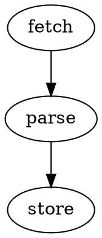

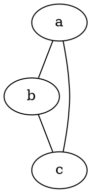

A chain (`fetch -> parse -> store;`) is one statement and two edges. Both graph
kinds may be prefixed with `strict`, which collapses duplicate edges between the
same pair into one; without `strict`, `graph { a -- b; a -- b; }` draws two
parallel lines. Verified both ways.

The graph may be named (`digraph pipeline { ... }`), and the name may be a
quoted string (`digraph "My Graph" { ... }`). The name is optional and does not
appear in the drawing; use `label` for a visible title.

### Identifiers

An identifier is one of: a bare atom of letters, digits, and underscores that
does not start with a digit; a numeral; a double-quoted string; or an HTML
string in angle brackets. **Hyphens are not legal in bare atoms** - verified,
`digraph { my-node -> b; }` is a syntax error. Quote any name with a hyphen,
space, or punctuation:

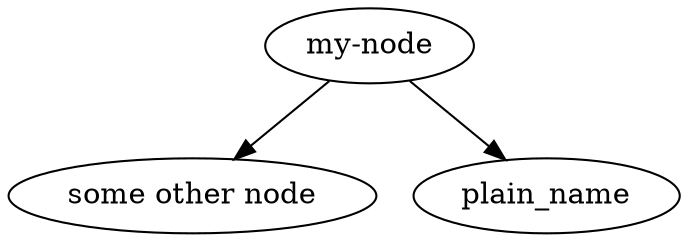

Keywords (`graph`, `digraph`, `node`, `edge`, `subgraph`, `strict`) are
case-insensitive; identifiers are case-sensitive, so `Alpha` and `alpha` are two
different nodes.

Comments are `//` to end of line, `/* ... */` anywhere, and `#` at the start of
a line. All three are verified.

## The three statement forms

### 1. Node statement - `name [attrs];`

Creates the node if it does not exist and applies attributes to it. Position in
the document does not matter: a node statement after the edge that first
mentioned the node still applies (verified - `digraph { a -> b; a [shape=diamond]; }`
draws `a` as a diamond).

### 2. Edge statement - `a -> b [attrs];`

The attribute list decorates the edge, not the endpoints. A target may be a
brace group, which fans out to one edge per member: `a -> { b c };` is two
edges.

### 3. Attribute statement - `node [attrs];` / `edge [attrs];` / `graph [attrs];`

Sets **defaults for items created after this point in the document**. This is
positional and it is the one place where statement order matters. Verified: in
`digraph { a -> b; node [shape=diamond]; c; }`, `a` and `b` stay ellipses and
only `c` is a diamond. Put your `node [...]` and `edge [...]` defaults at the
top.

Graph-level attributes may also be written bare, without brackets:
`rankdir=LR;` and `graph [rankdir=LR];` are equivalent.

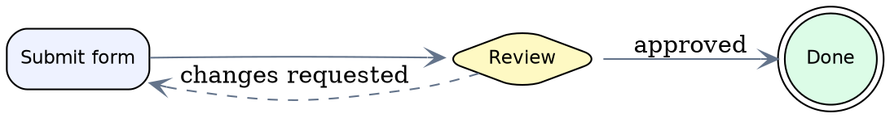

## The attributes that matter

Graphviz has hundreds of attributes. These carry almost all the weight:

| Attribute | Applies to | Notes |
|---|---|---|
| `label` | node, edge, graph, cluster | Display text. Quote anything with a space. On a graph or cluster it is the title. |
| `shape` | node | `box ellipse circle diamond hexagon cylinder note folder box3d component plaintext point doublecircle Mdiamond record Mrecord none` - all verified. |
| `color` | node, edge, cluster | Outline color (and cluster border). |
| `fillcolor` + `style=filled` | node, cluster | Interior color. `fillcolor` alone does nothing without `style=filled`. |
| `style` | node, edge, cluster | Node/cluster: `filled rounded dashed dotted bold invis`. Edge: `solid dashed dotted bold invis`. Combine with a **quoted** comma list: `style="rounded,filled"`. |
| `rankdir` | graph only | `TB` (default) `LR` `BT` `RL`. Graph-level only; setting it on a node or cluster does nothing. |
| `fontname` `fontsize` `fontcolor` | node, edge, graph | Set once as `node [...]` / `edge [...]` defaults. |
| `penwidth` `peripheries` | node, edge | Line weight, and number of outlines. |
| `arrowhead` `dir` | edge | `dir=none both back`; `arrowhead=normal vee empty odot none`. |
| `URL` `tooltip` | node, edge | Become `xlink:href` and `<title>` in SVG output. |

Colors are X11/SVG names (`red`, `lightgrey`, `cornflowerblue`) or hex
(`"#eef2ff"`). Quote hex values - the `#` starts a comment at line start and
quoting is always safe. A gradient is a color pair (`bgcolor="white:lightblue"`,
verified) and a two-tone fill is a weighted list
(`fillcolor="yellow;0.5:orange"`, verified).

Label text escapes, all verified: `\n` centers a new line, `\l` left-justifies
the line before it, `\r` right-justifies it, and `\N` expands to the node's own
name. Strings concatenate with `+`: `label="one " + "two"`.

## Clusters

A subgraph is drawn as a labeled box **only if its name begins with `cluster`**.
This is the most consequential silent failure in DOT: `subgraph tier { ... }`
parses, renders, and produces no box at all, with zero diagnostics. Verified in
15.1.1: `cluster_x`, `clusterx`, `Cluster_x`, and `CLUSTER_x` all produce a
cluster box; `x` and an anonymous subgraph do not. **Write `cluster_name`** - it
is the form every version and every tool recognizes.

A node belongs to the first cluster that names it. Listing the same node in two
clusters does not duplicate or move it (verified: the second listing is a no-op).

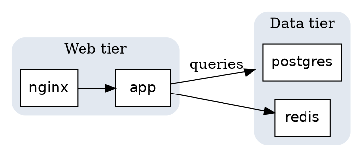

Edges attach to nodes, never to clusters. To make an edge *look* like it lands
on a cluster, set `compound=true` on the graph and then `lhead=cluster_name` (or
`ltail=`) on the edge; graphviz clips the edge at the cluster border. Verified:
`compound=true` measurably changes the drawn path; without it, `lhead` is
silently ignored and produces no warning.

Clusters nest. `subgraph cluster_outer { subgraph cluster_inner { ... } }`
renders as boxes inside boxes.

## Record labels

`shape=record` turns the label into a nested layout of fields. `|` splits
fields, `{ }` flips the split direction, and `<name>` at the start of a field
declares a **port** that edges can aim at with `node:port`. `Mrecord` is the
same with rounded corners.

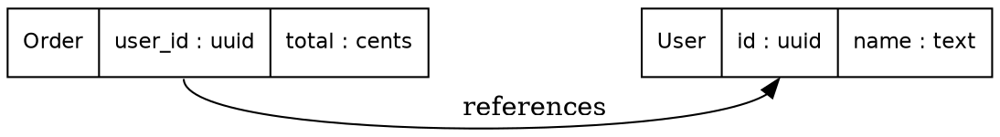

A compass point may follow the port: `order:uid:e -> user:id:w` aims from the
east side to the west side. Compass points also work without ports (`a:n -> b:s`).

Record field orientation follows `rankdir`: under the default `TB` the top-level
fields sit side by side, and under `rankdir=LR` they stack vertically. Verified
by measuring the drawn node - `{x|y|z}` is 76x45 points under `TB` and 62x83
under `LR`. Use `{ }` to force the direction you want rather than relying on the
default.

## HTML-like labels

Wrap the label in **angle brackets, not quotes**, and graphviz parses a small
HTML subset - tables, rows, cells, `<B>`, `<I>`, ``. Cells take a `PORT`
just like record fields. Pair it with `shape=plaintext` or `shape=none` so the
node's own outline does not fight the table's.

The quotes-versus-angles distinction is silent and total: `label="<B>bold</B>"`
renders the literal characters `<B>bold</B>` as text (verified - the SVG
contains `&lt;B&gt;`), while `label=<<B>bold</B>>` renders actual bold text.

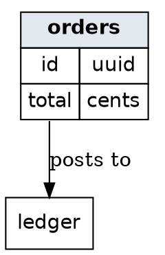

HTML attribute values inside the label must be double-quoted, and the tags are
conventionally uppercase. Unclosed tags are a parse error, unlike browser HTML.

## Ranking and layout control

Under the `dot` engine every node gets a rank, and rank becomes the row (or
column, under `rankdir=LR`). These control it:

- `{ rank=same; a; b; }` - an anonymous subgraph forcing nodes onto one rank.
  Also `rank=min`, `rank=max`, `rank=source`, `rank=sink`. All verified.
- `constraint=false` on an edge - draw it but do not let it influence ranking.
  This is how you add a back edge without stretching the graph.
- `weight=N` on an edge - higher weight pulls the endpoints closer and
  straighter. Use it to keep a happy path in a vertical line.
- `minlen=N` on an edge - minimum number of ranks the edge must span.
- `newrank=true` on the graph - required for `rank=same` to work across cluster
  boundaries.
- `ordering=out` on the graph - preserve the document order of a node's
  out-edges left to right.

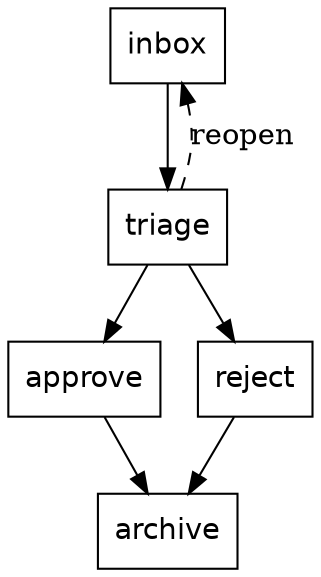

Spacing knobs, all graph-level: `nodesep` (within a rank), `ranksep` (between
ranks), `splines` (`spline` default, `ortho` for right angles, `polyline`,
`line`, `curved`), `concentrate=true` to merge parallel edge runs, and
`size="w,h"` with `ratio` to bound the drawing.

## Choosing a layout engine

The engine decides the whole geometry. Set it in the document with
`layout=name;` - verified: a document-level `layout` attribute overrides the
engine the caller requested, so state it explicitly when the choice matters.

| Engine | Reach for it when |
|---|---|
| `dot` | Anything with a direction: flowcharts, DAGs, dependency trees, state machines, org charts. The default and correct answer most of the time. |
| `neato` | Undirected graphs under roughly 100 nodes where relatedness, not flow, is the point. Spring model. Pair with `overlap=false`. |
| `fdp` | Same idea as `neato` but scales further and honors clusters. |
| `circo` | Cyclic structures: ring topologies, round-robin protocols, cycle-heavy graphs. |
| `twopi` | One clear center with everything radiating out. Set `root=nodename`. |
| `osage` | Packing clusters into an array; the drawing is the cluster arrangement, not the edges. |
| `patchwork` | Squarified treemap of node `area` values. Proportions, not connections. |

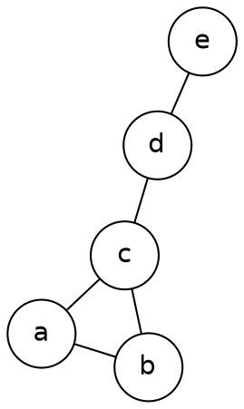

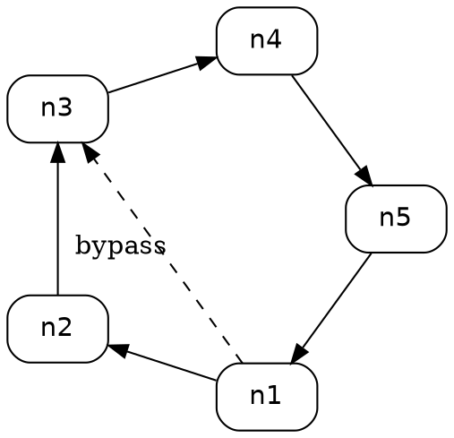

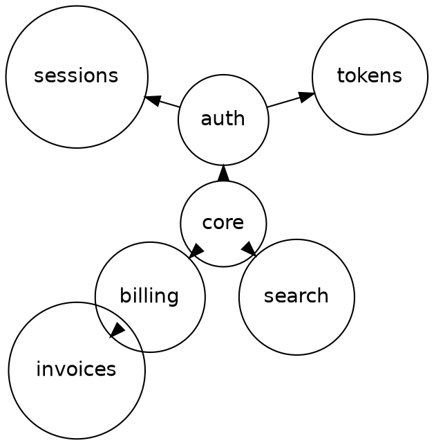

## Rendering

DOT source goes to this server's graphviz render tool, which returns SVG by
default and can rasterize to PNG or JPEG. Request a raster with a `width` of 640
or more for chat legibility. If no raster backend exists in the runtime the
render degrades to SVG plus a note rather than failing.

Invalid DOT comes back as structured diagnostics, never as an exception, so a
parse error is something to read and fix, not something to work around.

## Worked example: a release pipeline

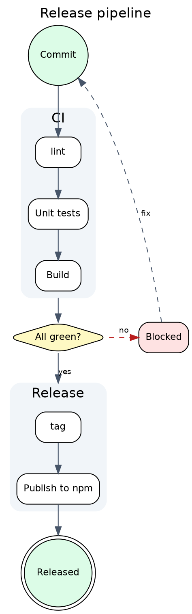

Every construct in it is covered above: graph-level title, defaults declared
before use, two clusters with the `cluster_` prefix, `compound=true` with
`lhead`/`ltail` so the edges clip at the cluster borders, a diamond decision
node, a non-constraining dashed rework edge, and `rank=same` pinning the
decision beside its failure state.

## Gotchas (all empirically verified)

- **Unknown attribute names are silently ignored.** `a [nonesuch=7];` renders
  with zero diagnostics. A misspelled attribute name is invisible; check the
  spelling against the table above rather than trusting a clean render.
- **A subgraph without a `cluster` name prefix draws no box**, silently.
- **`lhead`/`ltail` do nothing without `compound=true`** on the graph, silently.
- **`fillcolor` does nothing without `style=filled`.**
- **An unknown shape falls back to a box with a warning**
  (`using box for unknown shape trapezoidal`), and an unknown color warns
  (`notacolor is not a known color.`). Warnings do not fail the render, so read
  them.
- **Attribute defaults are positional; node and edge statements are not.**
  `node [shape=box];` affects only what comes after it. `a [shape=box];` affects
  node `a` wherever it appears.
- **Bare identifiers cannot contain hyphens.** `my-node` is a syntax error;
  `"my-node"` is fine.
- **HTML-like labels need angle brackets.** Quoted markup renders as literal
  characters with no warning.
- **`style` lists must be quoted.** `style="rounded,filled"`, not
  `style=rounded,filled`, which ends the attribute at the comma.
- **Other DSLs do not parse.** Mermaid's `graph TD; A[Start] --> B[End];` fails
  with `syntax error in line 1 near ';'`. There is no `-->`, no `[Label]` node
  shorthand, no `%%` comment, and no `end` keyword.

## Agent directives

- **Pick `digraph`/`->` or `graph`/`--` before writing anything**, and keep the
  pairing consistent through the whole document.
- **Use the exact node names the task gives you**, including case. Identifiers
  are case-sensitive.
- **Quote every string that is not a bare atom** - labels, hex colors, style
  lists, and any name with a space, hyphen, or punctuation.
- **Declare `node [...]` and `edge [...]` defaults at the top**, before the
  statements they should affect.
- **Prefix every box-drawing subgraph with `cluster_`.**
- **Set `compound=true` whenever you use `lhead` or `ltail`.**
- **Reach for `dot` unless the diagram has no direction.** Change engines with a
  document-level `layout=` so the choice travels with the source.
- **Do not invent syntax.** DOT has no variables, conditionals, loops, includes,
  functions, or expressions. If a construct is not in this guide, do not emit it.
- **One graph per document.** A DOT file holds exactly one top-level `graph` or
  `digraph`.
